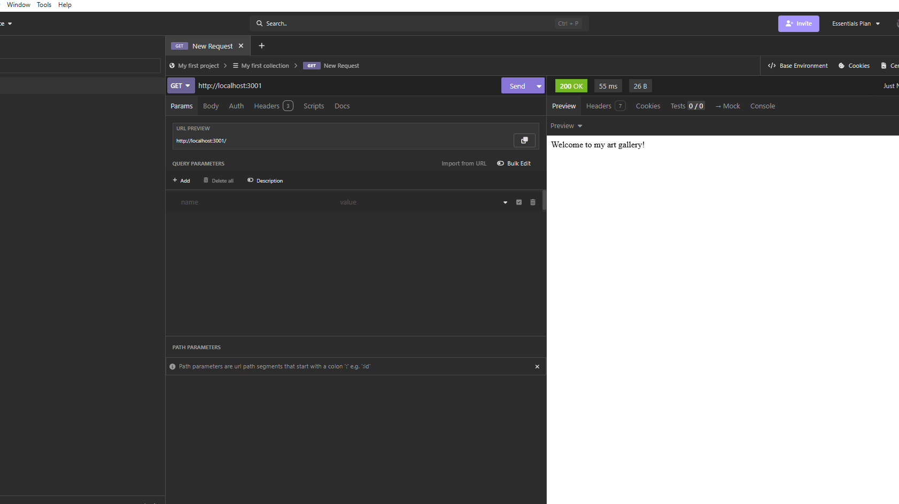
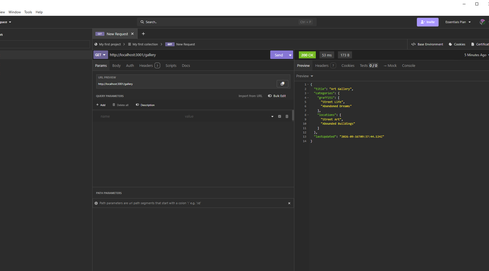
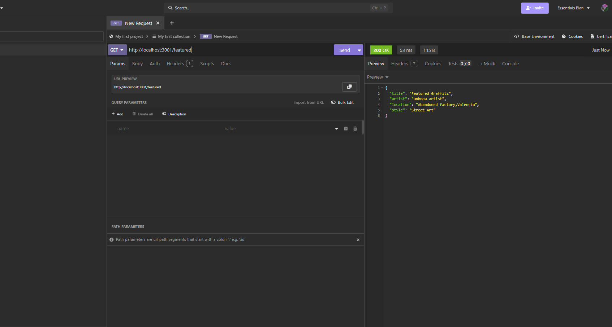
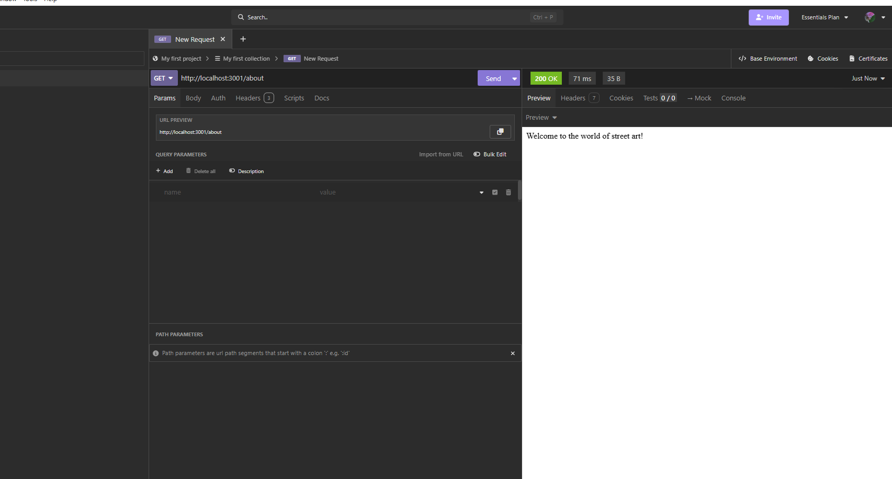
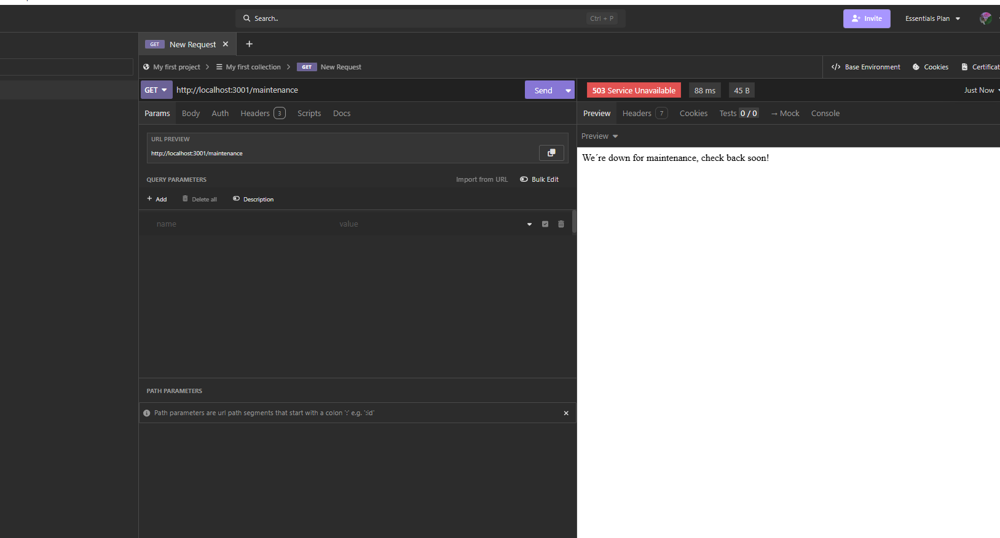

# HTTP Express API

My first Express API built with typeScript

## Routes

### GET /
Returns a welcome message.
**Status:** `200 OK`

### GET /gallery
Returns the street art gallery. 
**Status:** `200 OK`

### GET /featured
Returns the featured artwork. 
**Status:** `200 OK`

### GET /about
Returns information about the Street Art API 
**Status:** `200 OK`

### GET /maintenance 
Returns a maintenance message. 
**Status:** `503 Service Unavailable`
